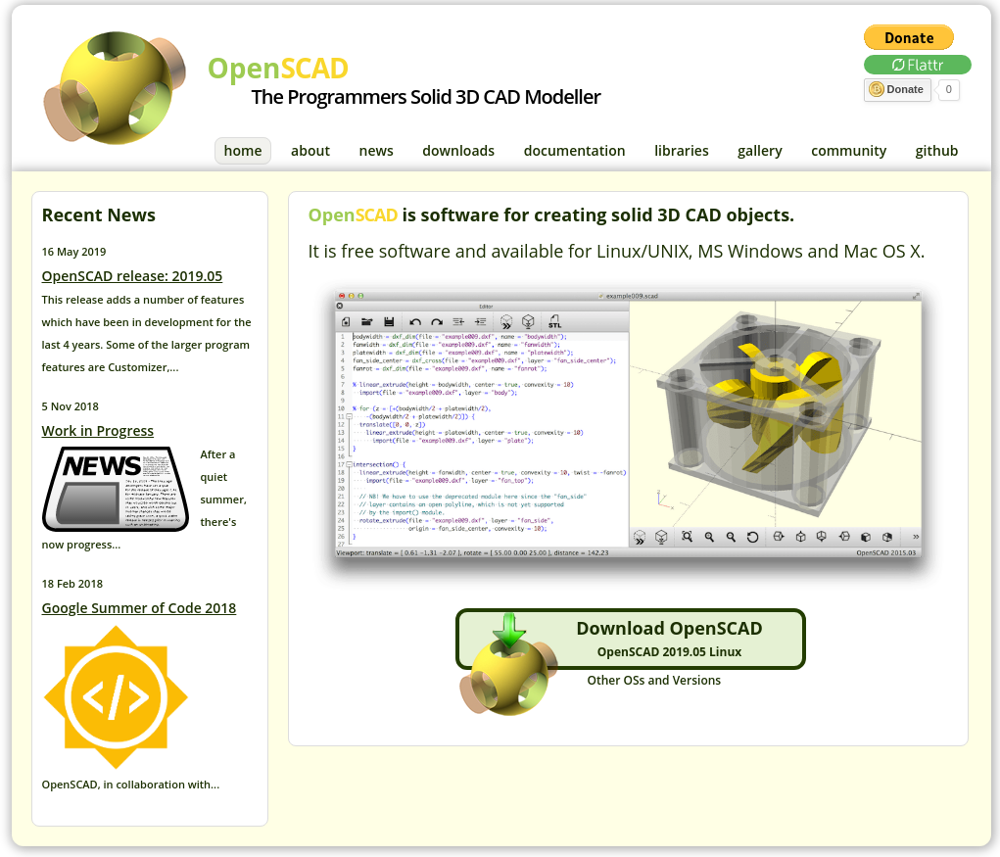
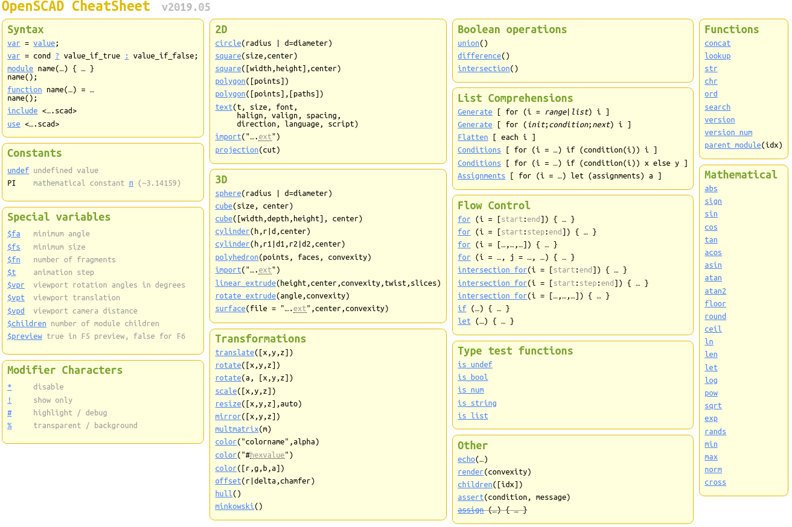
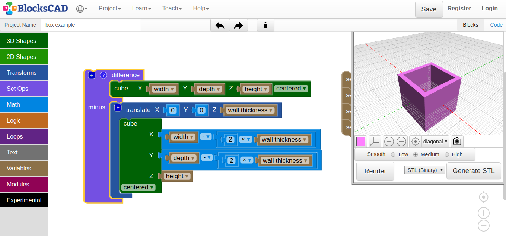

# openscad_summerCamp

## [Sito ufficiale OPENSCAD](https://www.openscad.org/index.html) 

 

## [Installazione](https://www.openscad.org/downloads.html)
Aggiungere repo se non presente in quelli ufficiali della versione:

    sudo add-apt-repository ppa:openscad/releases
    sudo apt-get update
    sudo apt-get install openscad

## [Cheat sheet dei comandi:](https://www.openscad.org/cheatsheet/index.html) 

 

## [Blockscad: Openscad for Dummies](https://www.blockscad3d.com/editor/) 

 

## [Thingverse: una web-app per Openscad](https://www.thingiverse.com/)

Registrandosi a [Thingverse](https://www.thingiverse.com/) e caricando i propri modelli **Openscad** è possibile ottenere automaticamente una pagina web nella quale modellare i propri progetti in modo parametrico.
Attraverso la propria applicazione [Customizer](https://www.thingiverse.com/app:22/things), viene costruita una pagina web nella quale, tramite caselle di testo, menù a tendina o slider, è possibile renderizzare modelli parametrici.
Ovviamente bisogna avere l'accortezza di realizzare progetti che facciano uso di variabili e i *// commenti* rispettino certe sintassi.

A quest'indirizzo trovi le [istruzioni per utilizzare Customizer](https://customizer.makerbot.com/docs) e a questo [numerosi esempi](https://www.thingiverse.com/app:22/things) numerosi esempi.

**È richiesto il login**

[Esempio 1: un timbro personalizzabile](https://www.thingiverse.com/apps/customizer/run?thing_id=3234634)
