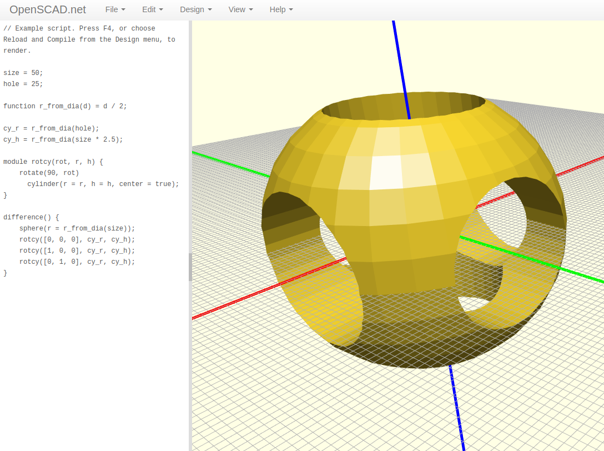
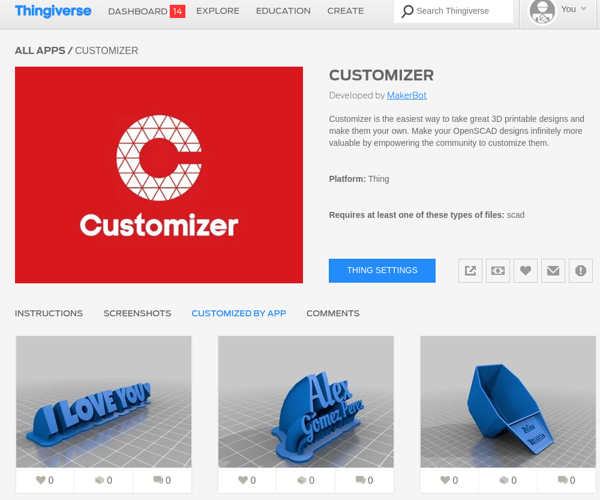
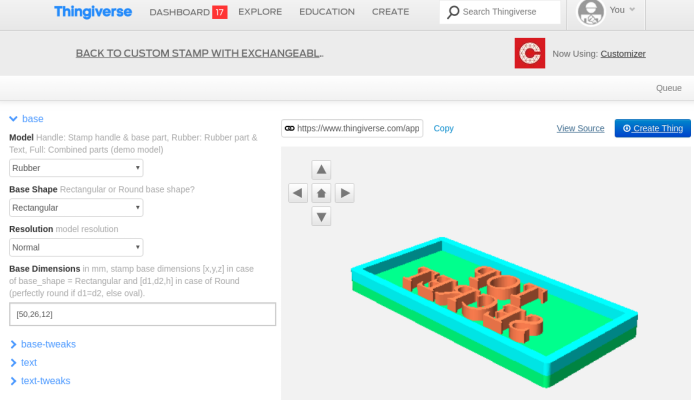
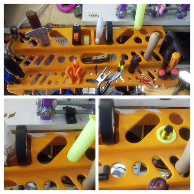
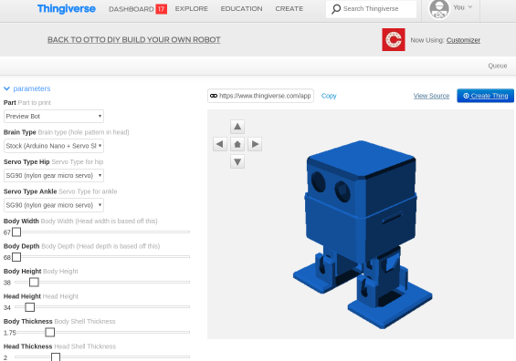

# openscad_summerCamp

[Link alle slide d'introduzione](https://docs.google.com/presentation/d/1AahNq-qOJ2fLGVGkCj6AsqyVDybipH6feOgBKgXtdCk/edit?usp=sharing) 

## [Sito ufficiale OpenSCAD](https://www.openscad.org/index.html) 

 

## [Installazione](https://www.openscad.org/downloads.html)
Aggiungere i repo se OpenSCAD non risulta presente in quelli della tua distro:

    sudo add-apt-repository ppa:openscad/releases
    sudo apt-get update
    sudo apt-get install openscad

## [Documentazione, manuali e tutorial:](https://www.openscad.org/documentation.html) 

La pagina ufficiale della [Documentazione](https://www.openscad.org/documentation.html) è ben fornita.

Per una panoramica rapida è molto comodo il **cheat sheet**.
I link dei comandi rimandano a questo [wikibook](https://it.wikibooks.org/wiki/OpenSCAD/Linguaggio_OpenSCAD).

 

## [Editor online](http://openscad.net/)

## [Blockscad: OpenSCAD for Dummies](https://www.blockscad3d.com/editor/) 

 

***

## [Thingverse: una web-app per OpenSCAD](https://www.thingiverse.com/)

Registrandosi a [Thingverse](https://www.thingiverse.com/) e caricando i propri modelli **OpenSCAD** è possibile ottenere automaticamente una pagina web nella quale modellare i propri progetti in modo parametrico.
Attraverso la propria applicazione [Customizer](https://www.thingiverse.com/app:22/things), viene costruita una pagina web nella quale, tramite caselle di testo, menù a tendina o slider, è possibile renderizzare modelli parametrici.
Ovviamente bisogna avere l'accortezza di realizzare progetti che facciano uso di variabili e i *// commenti* rispettino certe sintassi.

A quest'indirizzo trovi le [istruzioni per utilizzare Customizer](https://customizer.makerbot.com/docs) e a questo [numerosi esempi](https://www.thingiverse.com/app:22/things) numerosi esempi.

**È richiesto il login**

* [Esempio 1: un timbro personalizzabile](https://www.thingiverse.com/apps/customizer/run?thing_id=3234634)

* [Esempio 2: porta strumenti cilindrico](https://www.thingiverse.com/apps/customizer/run?thing_id=3725668)

* [Esempio 3: Otto Robot](https://www.thingiverse.com/apps/customizer/run?thing_id=1568652)

* [Esempio 4: Bulloni](https://www.thingiverse.com/apps/customizer/run?thing_id=193647)

***

## Dove reperire codice d'esempio in rete

Ecco alcuni luoghi ricchi di modelli realizzati in OpenSCAD:

* [Galleria del sito ufficiale](https://www.openscad.org/gallery.html) 

* [Esempi da BlocksSCAD](https://www.blockscad3d.com/community/projects#/?_k=mgbhn6) sono reperibili sul sito.

* [Sezione Customizable di Thingverse](https://www.thingiverse.com/customizable) 

* [Prusa i3 - stampante 3D](https://github.com/prusa3d/Original-Prusa-i3) 

* [Prusa i3 - vanilla](https://github.com/josefprusa/Prusa3-vanilla)

## Linguaggi derivati o collegati a OpenSCAD

* [**OpenJSCAD**:OpenSCAD + JavaScript](https://openjscad.org/#) 

* [**SolidPython**: OpenSCAD + Python](https://github.com/SolidCode/SolidPython) 

* [**GraphCAD**: in stile Grasshopper](https://graphscad.blogspot.com/) 

* [**Inkscape to OpenSCAD**: modelli dal disegno vettoriale](https://www.thingiverse.com/thing:25036) 